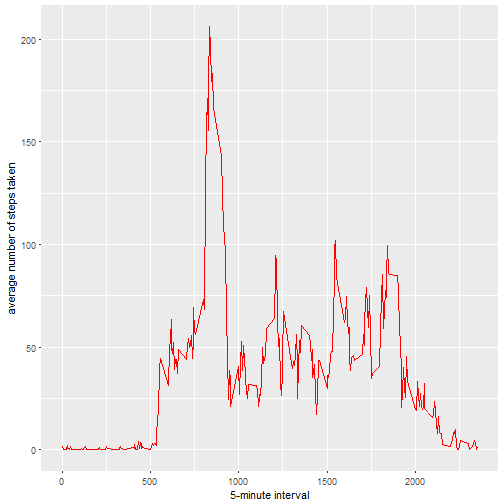

## Average total number of steps taken per day

============================================================


```r
library(ggplot2)
```

```
## Warning: package 'ggplot2' was built under R version 3.3.2
```

```r
library(dplyr)
```

```
## Warning: package 'dplyr' was built under R version 3.3.2
```

```
## 
## Attaching package: 'dplyr'
```

```
## The following objects are masked from 'package:stats':
## 
##     filter, lag
```

```
## The following objects are masked from 'package:base':
## 
##     intersect, setdiff, setequal, union
```

```r
library(Hmisc)
```

```
## Warning: package 'Hmisc' was built under R version 3.3.2
```

```
## Loading required package: lattice
```

```
## Loading required package: survival
```

```
## Warning: package 'survival' was built under R version 3.3.2
```

```
## Loading required package: Formula
```

```
## Warning: package 'Formula' was built under R version 3.3.2
```

```
## 
## Attaching package: 'Hmisc'
```

```
## The following objects are masked from 'package:dplyr':
## 
##     combine, src, summarize
```

```
## The following objects are masked from 'package:base':
## 
##     format.pval, round.POSIXt, trunc.POSIXt, units
```

```r
data1<-read.csv("C:\\Users\\Mohamed\\Documents\\activity.csv")
x<-aggregate(data1$steps,by=list(data1$date),FUN=sum)
names(x)<-c("date","steps")
```

### Histogram

====================


```r
qplot(x$steps, binwidth = 1000, xlab = "total number of steps taken each day")
```

```
## Warning: Removed 8 rows containing non-finite values (stat_bin).
```


### the mean of the total number of steps taken per day

==================================================================

```r
mean(x$steps,na.rm = TRUE)
```

```
## [1] 10766.19
```
### the median of the total number of steps taken per day

==================================================================

```r
median(x$steps,na.rm = TRUE)
```

```
## [1] 10765
```

## the average daily activity pattern


```r
data1<-read.csv("C:\\Users\\Mohamed\\Documents\\activity.csv")
x<-aggregate(data1$steps,by=list(data1$interval),FUN=mean,na.rm=TRUE)
names(x)<-c("intervals","steps")
```
# Graph 


```r
ggplot(data = x,aes(x$intervals,x$steps))+geom_line(col="red") + xlab("5-minute interval") + ylab("average number of steps taken") 
```



## the maximum number of steps


```r
x[which.max(x$steps),]
```

```
##     intervals    steps
## 104       835 206.1698
```

## Imputing missing values


```r
data1<-read.csv("C:\\Users\\Mohamed\\Documents\\activity.csv")
missing<-filter(data1,is.na(data1$steps))
nrow(missing)
```

```
## [1] 2304
```

```r
y<-mutate(data1,steps=with(data1,impute(steps,mean)))
x<-aggregate(y$steps,by=list(y$date),FUN=sum)
names(x)<-c("date","steps")
qplot(x$steps, binwidth = 1000, xlab = "total number of steps taken each day")
```


```r
mean(x$steps)
```

```
## [1] 10766.19
```

```r
median(x$steps)
```

```
## [1] 10766.19
```

## Differences in activity patterns between weekdays and weekends


```r
data1<-read.csv("C:\\Users\\Mohamed\\Documents\\activity.csv")
y<-mutate(data1,steps=with(data1,impute(steps,mean)))
y[,"date"]<-as.Date(y$date)
y[,"steps"]<-as.numeric(y$steps)

dayofweek<-function(date)
{
  day <- weekdays(date)
  if (day %in% c("Monday", "Tuesday", "Wednesday", "Thursday", "Friday")) 
  return("weekday") else if (day %in% c("Saturday", "Sunday")) 
  return("weekend") else("Not Applicable")  
}
y$date<-sapply(y$date,FUN = dayofweek)
x<-aggregate(y$steps~y$interval+y$date ,data = y ,FUN=mean)
names(x)<-c("steps","day","interval")
ggplot(x, aes(x$steps, x$interval)) + geom_line() + facet_grid(day ~ .) + 
  xlab("5-minute interval") + ylab("Number of steps")
```


